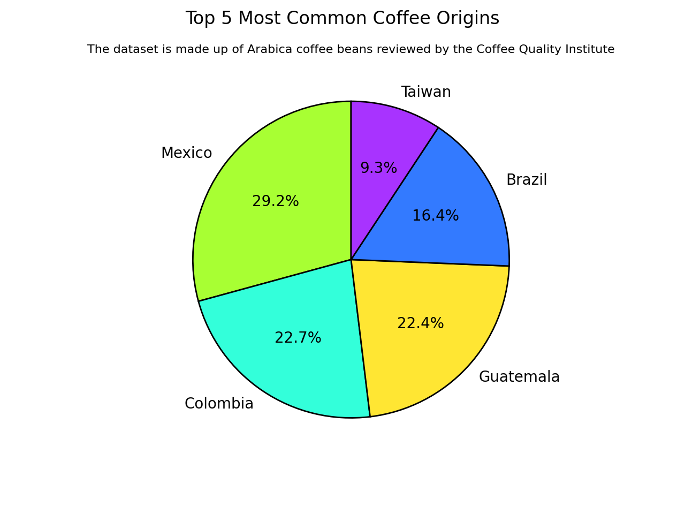

# Data visualization using matplotlib #

[**project instructions** ](https://github.com/mikeizbicki/cmc-csci040/tree/2021fall/hw_02)

## Netflix TV Show/Movie Runtimes
In this visualization I used data from [Shivam Bansal on Kaggle](https://www.kaggle.com/shivamb/netflix-shows) that had information about netflix shows in a csv dataset. There were many details recorded including: title, duration, genre, actors, director, date added, country, rating, and release year. 

## Coffee Production and Exports in 2018
In this visualization I used data from [Yaman Eren Ay on Kaggle](https://www.kaggle.com/yamaerenay/ico-coffee-dataset-worldwide?select=total-production.csv). There were many datasets available regarding coffee exports, production, imports, and prices. 

