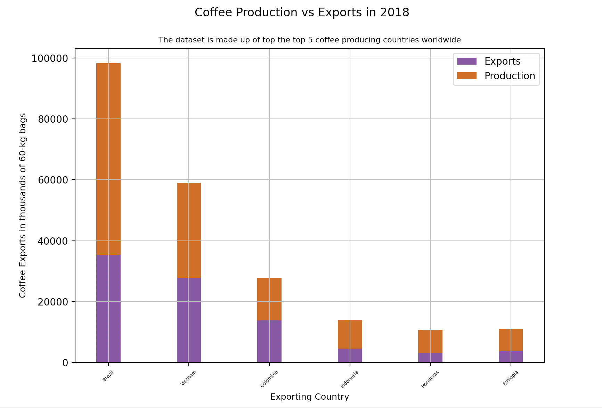

# Data visualization using matplotlib #

[**project instructions** ](https://github.com/mikeizbicki/cmc-csci040/tree/2021fall/hw_02)

## Netflix TV Show/Movie Runtimes
In this visualization I used data from [Ankur Chavda on Kaggle](https://www.kaggle.com/ankurchavda/coffee-beans-reviews-by-coffee-quality-institute) that had information about coffees rated by the Coffee Quality Institute in a csv dataset. There were many details recorded including: species, owner, country of origin, farm name, lot number, mill, company, and altitude. I focused on origin to determine which top 5 origins came up the most often. 

## Coffee Production and Exports in 2018
In this visualization I used data from [Yaman Eren Ay on Kaggle](https://www.kaggle.com/yamaerenay/ico-coffee-dataset-worldwide?select=total-production.csv). There were many datasets available regarding coffee exports, production, imports, and prices. Using two csv datasets on coffee exports and production, I compared exports and production for the top 5 largest producers of coffee in 2018- Brazil, Vietnam, Colombia, Indonesia, Honduras, and Ethiopia. 

